# Welcome to Mycat
## 初次使用指南
### 一、 模版导入
mycat使用模版在项目包的template目录下，使用的模版文件名为mycat-style.xml。  
  
具体配置参考：
#### Intellij IDEA
1. 打开IDEA的 Preferences->Editor->Code Style_Java  
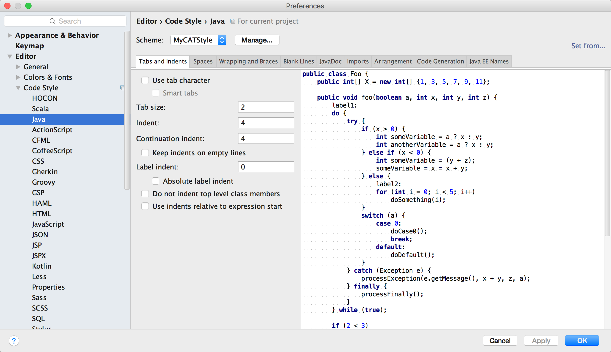  
2. 点击右侧区域的Manage，在弹出的选项中选择Import  
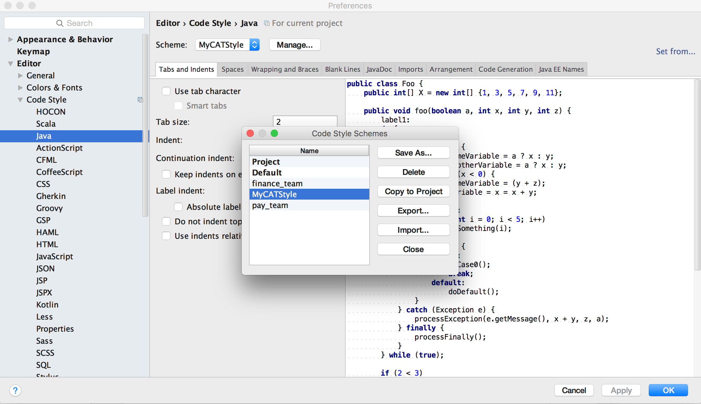  
3. 在弹出的选项中选择Eclipse XML Profile  
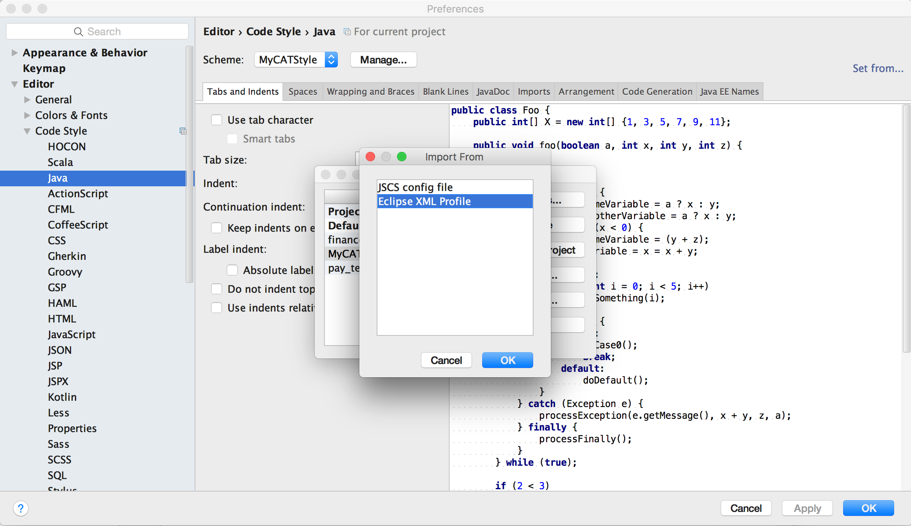  
4. 选择mycat-style.xml文件，并点击ok  
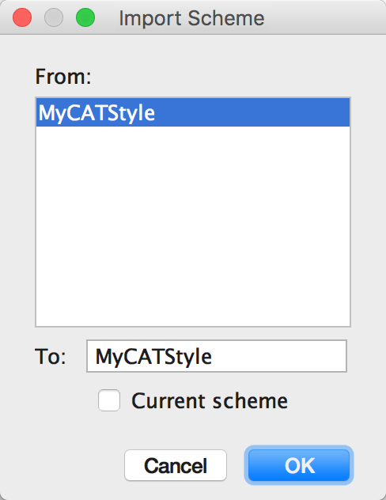  
5. 添加完后在Schema中选择MyCATStyle，并点击右下角的ok  
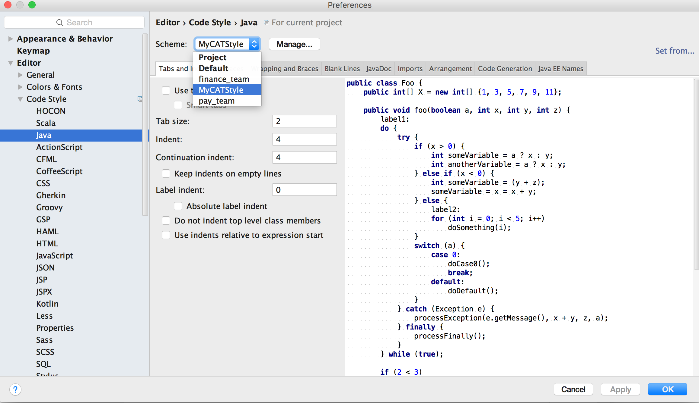

#### Eclipse
1. 打开Eclipse的 Preferences->Java->Code Style->Formatter  
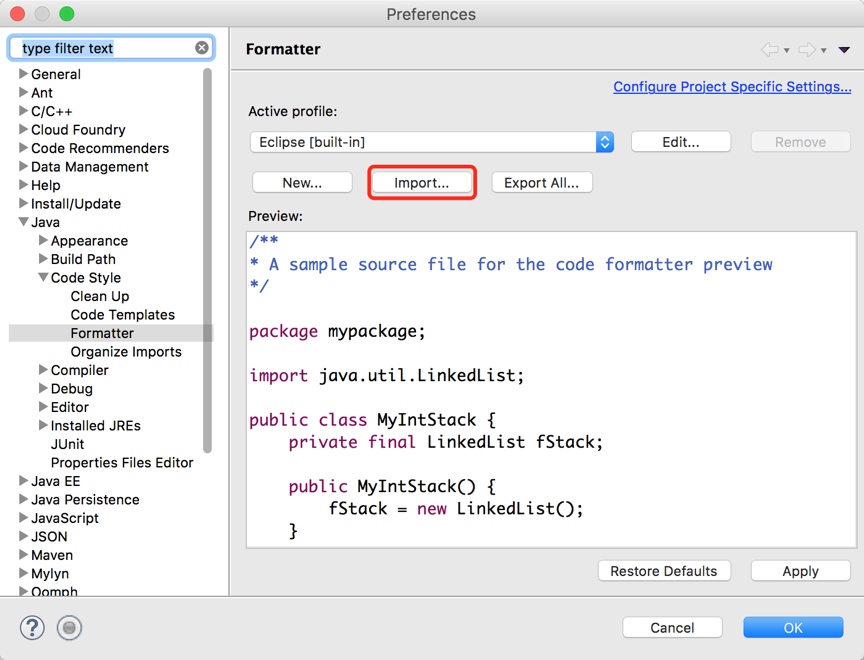  
2. 点击Import将mycat-style.xml加入进profile中  
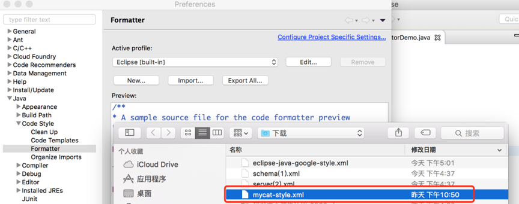  
3. 在Active profile的下拉列表中选择MyCATStyle  
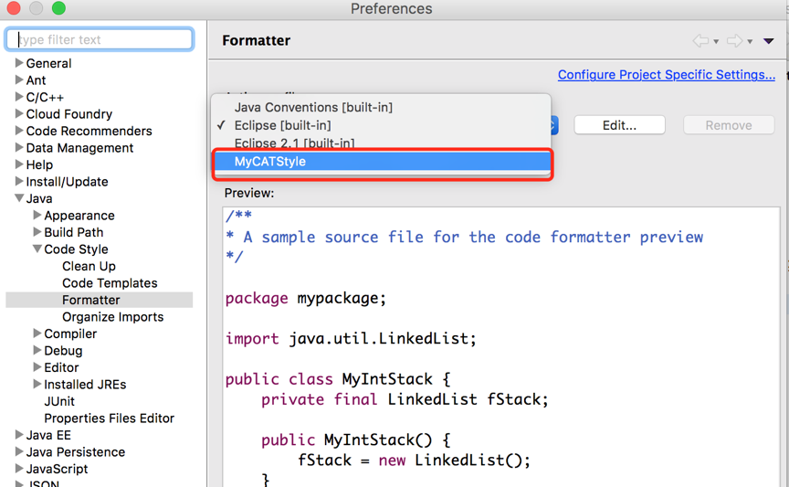  

### 二、 保存自动格式化（可选）
#### Intellij IDEA
1. IDEA的自动保存格式化需要添加plugin，在 Preferences->Plugins 中输入 Save Actions，在右侧框框中点击安装  
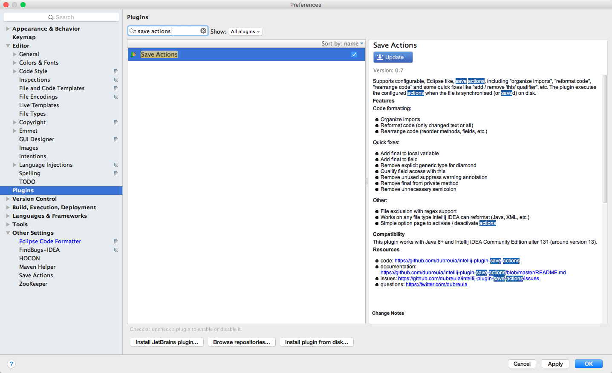  
2. 在 Preferences->Other Settings 中选择 Save Actions 配置自动保存时的操作  
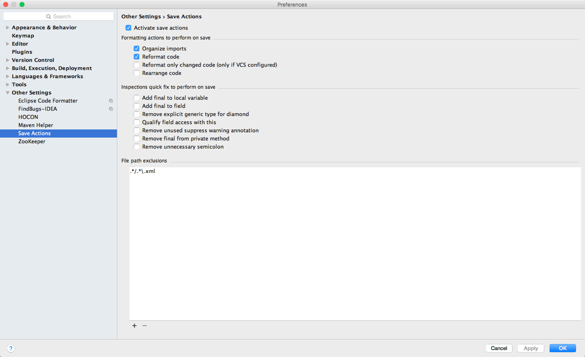  

#### Eclipse
在Eclipse的 Preferences->Java->Editor->Save Action 中勾选自动保存时的行为，如下所示，并点击Apply、OK  
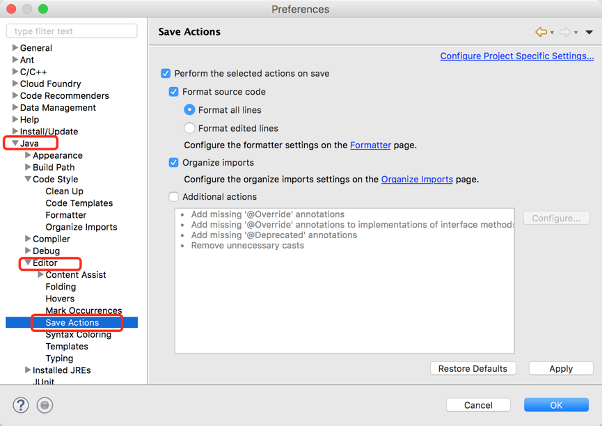  

至此配置完毕，在写完代码保存之后即可完成格式化。